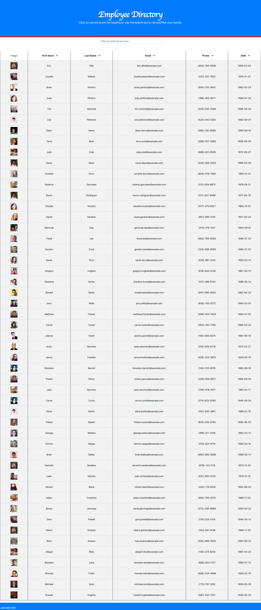

# Employee Directory

 [](https://github.com/jdbell123/employee-directory/issues)
 [](https://github.com/jdbell123/employee-directory/stargazers)
## Table of Contents

* [Reason](#reason)
* [Learnt](#learnt)
* [Take-Aways](#Take-Aways)
* [Installation](#installation)
* [Usage](#usage)
* [Credits](#credits)
* [License](#license)
* [Links](#links)

***

## Reason

The reason for this assignment this week was to learn about using react. We were given the following User Story and Acceptance Criteria:

```md
Given a table of random users generated from the [Random User API](https://randomuser.me/), when the user loads the page, a table of employees should render. 

The user should be able to:

  * Sort the table by at least one category

  * Filter the users by at least one property.
```

---

## Learnt

Working on this project I have learnt about the following things:

    1 - Gained knowledge on using React
    2 - Gained knowledge on using State within React and responding to user events
    3 - Gained knowledge on deploying React Apps to GitHub Pages
    4 - Expanded knowledge on JavaScript
    5 - Expanded knowledge on deailing with data (sorting and filtering)
    
---

## Take-Aways

This was a tough project as there were lots of new things going on in this one. My main take away from this assignment is to pay more attention to the details being taught in class and try and complete the assignments as soon as possible after class when it is still fresh in memory.

---

## Installation

To install the required libraires for this application use the following command to install the application locally:

```
npm i
```

There is a deployed version of this application. Just navigate to the URL to see the application.

* [Links](#links)

---

## Usage 

To use this application type the following command into your terminal/command prompt (after installing it):

```
npm start
```

Once the local server is running navigate to http://localhost:3000/ to see the app in action.

Here is a screenshot of the finished application:



---

## Credits

As always thanks to my BFF Google for being there in my hours of need. Also, to my fellow class mates for the study groups and hints/tips I received on this project. Last but not least a thank you to the tutor and TAs for the guidance and support they gave on this project. 

---

## License


Licensed under the [MIT](./LICENSE) license.


---

## Links

[GitHub Repo](https://github.com/jdbell123/tech_blog)

[Deployed App](https://jdbell123.github.io/employee-directory/)